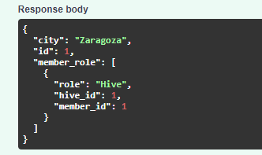
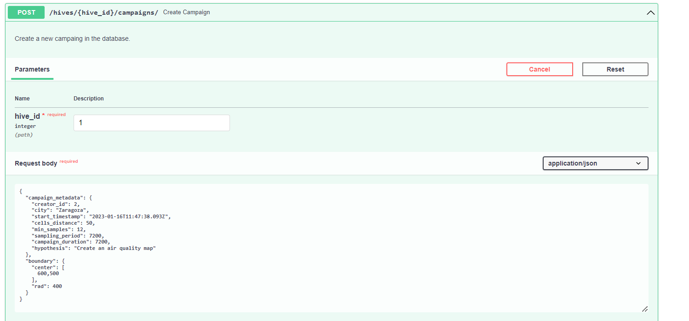

 
1. `pip install poetry` (or safer, follow the instructions: https://python-poetry.org/docs/#installation)
2. Install dependencies `cd` into the directory where the `pyproject.toml` is located then `poetry install`
3. [UNIX] Run `cd Model` 
4. [UNIX] Run `sudo mysql -uroot -p < BaseDatos.v6.sql`
5. [UNIX] Run `cd ..`
6. [UNIX]: Run the FastAPI server via poetry with the bash script: `poetry run ./run.sh`
6. [WINDOWS]: Run the FastAPI server via poetry with the Python command: `poetry run python src/Servicio/app/main.py`
7. Open http://localhost:8001/ <!---!> 

Use case - Example: 

1. **Create a Hive** At [http://localhost:8001](http://localhost:8001) in secction Hives at the endpoint post. 

Click on Post endpoint and then in "Try it out" botton and complete the Request body (pìcture example) and click execute 

And we can see the created hive: 

2. **Create a QueenBee and two WorkingBee** At http://localhost:8001 in secction Member at the endpoint post. 

For each new member we have to click on Post endpoint and then in "Try it out" botton, complete the hive_id with the od of the previusly created  hive and complete the Request body in the case of QueenBee the role has toi bve QueenBee and for the both WorkerBee, WorkerBee. Click execute.

Using the /hives/{hive_id}/members/ endpoint we can see all the members of the hive. 

NOTE: if we want to associeted another role to a pre-created used, we have to use the POST role endpoint using the id of the hive and the id of the user. 
3. **Define two devices:**  At [http://localhost:8001](http://localhost:8001) in secction Devices at the endpoint post. 

Fopr each device, click on Post endpoint and then in "Try it out" botton and complete the Request body (pìcture example) and click execute. 

And we can see the created device: 

4. **Create a Campaign:** At http://localhost:8001 in secction Campaign at the endpoint post. 

For example, if we want to create a sort campaign with the objetive of get air quality data of a small area. So the estrategy of this campaign is collect as many measurements as possible for the duration of the campaign (which should not be long). Click on Post endpoint and then in "Try it out" botton and complete the Request body (pìcture example). çThe created_id was to be the id of a QueenBee  of the hive.  

