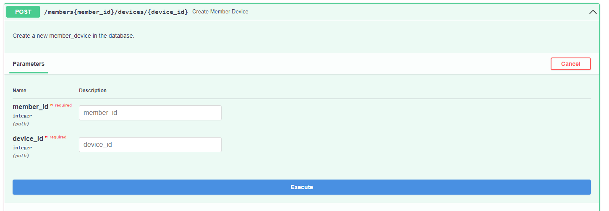
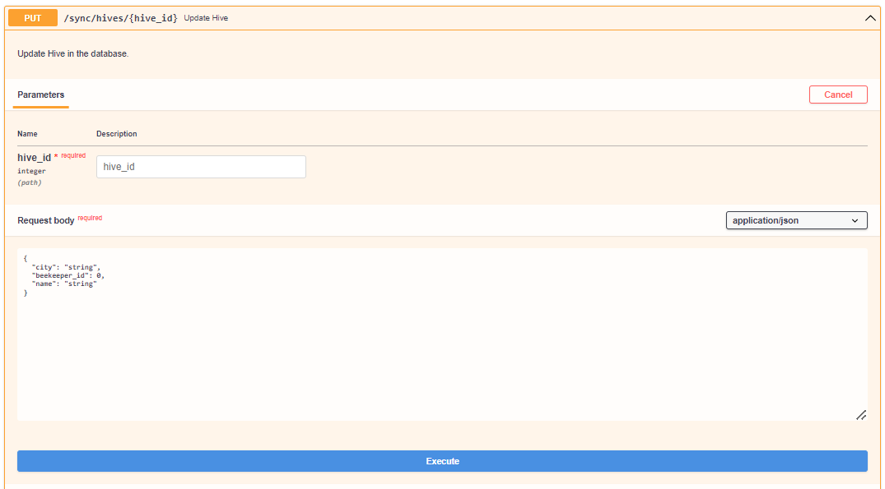

# RUN the system 

You have to follow these steps to be able to launch the Micro-Volunteering Engine (MVE): 
1. `pip install poetry` (or safer, follow the instructions: https://python-poetry.org/docs/#installation)
2. Install dependencies `cd` into the directory where the `pyproject.toml` is located then `poetry install`
3. [UNIX] Run `cd Model` 
4. [UNIX] Run `sudo mysql -uroot -p < BaseDatos.v7.sql`
5. [UNIX] Run `cd ..`
6. [UNIX]: Run the FastAPI server via poetry with the bash script: `poetry run ./run.sh`
6. [WINDOWS]: Run the FastAPI server via poetry with the Python command: `poetry run python src/Servicio/app/main.py`
7. Open http://localhost:8001/docs 

# Use case - Example: 

1. **Create a Beekeeper:**  At [http://localhost:8001](http://localhost:8001) in secction Beekeeper at the POST endpoint [/beekeepers/](http://localhost:8001/docs#/BeeKeepers/create_beekeeper_beekeepers__post) you can create a new beekeeper. 
    

2. **Create a Hive** At [http://localhost:8001](http://localhost:8001) in secction Hives at the POST endpoint [/hives/](http://localhost:8001/docs#/Hives/create_hive_hives__post), you can create a new hive by filling out the request body of this endpoint. 
    
    
    We can see the newly created hive: 
    

3. **Create Members:** At [http://localhost:8001](http://localhost:8001) in section Member at the POST endpoint [/members/](http://localhost:8001/docs#/Members/create_member_members__post), you can create a new member. 
    
    

4. **Associate members with a hive with a role:** At [http://localhost:8001](http://localhost:8001) in section Hive at the POST endpoint [/hives/{hive_id}/members/{member_id}/](http://localhost:8001/docs#/Hives/associate_existing_member_with_a_hive_with_specific_role_hives__hive_id__members__member_id___post) you can asociate a existing user with a hive with a role. In this way, you define the role this user has in the hive. 

5. **Define devices:**  At [http://localhost:8001](http://localhost:8001) in secction Devices at the POST endpoint [/devices/](http://localhost:8001/docs#/Device), you can define a device. For each device, click on the POST endpoint and then in the "Try it out" button and complete the Request body (picture example) and click execute. 

And we can see the created device: 

6. **Associate a device with a member:** At [http://localhost:8001](http://localhost:8001) in section Member at the POST endpoint [/members{member_id}/devices/{device_id}](http://localhost:8001/docs#/Members/create_member_device_members_member_id__devices__device_id__post), you can associate a device with a member. 

7. **Create a Campaign:** At http://localhost:8001](http://localhost:8001) in section Campaign at the POST endpoint [/hives/{hive_id}/campaigns/](http://localhost:8001/docs#/Campaigns/create_campaign_hives__hive_id__campaigns__post)
    
   For example, if we want to conduct a brief campaign to collect data on air quality in a particular area, the strategy must include collecting as many measurements as possible during the campaign time (which should not be long). These characteristics should be specified in the POST request body of this endpoint (picture example).
    
    Before creating the campaign, you can find out the centres of the cells through the following POST endpoint    [/hives/{hive_id}/campaigns/
    /points/](http://localhost:8001/docs#/Sync/create_points_of_campaign_points__post). This can be done to be able to observe where measurements during the campaign should be obtained.
    
    In addition, after the creation of the campaign, we can visualize the campaign map with the show endpoint at the campaign section [/hives/{hive_id}/campaigns/{campaign_id}/show](http://localhost:8001/docs#/Campaigns/show_a_campaign_hives__hive_id__campaigns__campaign_id__show_get) endpoint. As an example of the result: 
    

8. **DEMO** If we want to visualize how the micro-volunteering engine works, you may execute the demo endpoint in the demo section. The result generated is stored at the src/Servicio/app/Pictures/Measurements and src/Servicio/app/Pictures/Recommender folders. 

# Use case (integrasion with SocioBee ArcadeMe)- Example: 

The diagram below shows the process that has to be carried out within SOCIO-BEE to set-up a campaign in a pilot where air quality measurements will be gathered in a certain area and time period in order to deliver visualizations and indicators summarizing the air quality situation and evolution in a spatiotemporal manner. 

1. **Synchronize beekeeper:** We have to synchronize the beekeepers. 
At [http://localhost:8001](http://localhost:8001) in section Sync at endpoint put [/sync/beekeepers/{beekeeper_id}](http://localhost:8001/docs#/Sync/put_a_beekeeper_sync_beekeepers__beekeeper_id__put). Click on Put endpoint and then in the "Try it out" button, complete the Request body (picture example) and click execute 
    

2. **Synchronize Hive:** We have to synchronize the hive. At [http://localhost:8001](http://localhost:8001) in secction Sync at the endpoint put  [/sync/hives/{hive_id}](http://localhost:8001/docs#/Sync/update_hive_sync_hives__hive_id__put). 
Click on Put endpoint and then in the "Try it out" button, complete the Request body (pìcture example) and click execute 
    

3. **Synchronize Member of the hive:** We have to synchronize hive's members and their roles. At [http://localhost:8001](http://localhost:8001) in section Sync at endpoint put  [/sync/hives/{hive_id}/members/](http://localhost:8001/docs#/Sync/update_members_sync_hives__hive_id__members__put). Click on Put endpoint and then in the "Try it out" button, complete the Request body (pìcture example) and click execute
    

4. **Create a Campaign:** At http://localhost:8001](http://localhost:8001) in section Campaign at the endpoint post [/hives/{hive_id}/campaigns/](http://localhost:8001/docs#/Campaigns/create_campaign_hives__hive_id__campaigns__post)
    
   For example, if we want to conduct a brief campaign to collect data on air quality in a particular area, the strategy must include collecting as many measurements as feasible during the campaign time (which should not be long). These characteristics should be specified in the POST request body of this endpoint (picture example).
    
    Previously creating the campaign, you can get the centres of the cells with the endpoint    [/hives/{hive_id}/campaigns/
    /points/](http://localhost:8001/docs#/Sync/create_points_of_campaign_points__post)
    
    In addition, after the creation of the campaign, we can visualize the campaign map with the show endpoint at the campaign section [/hives/{hive_id}/campaigns/{campaign_id}/show](http://localhost:8001/docs#/Campaigns/show_a_campaign_hives__hive_id__campaigns__campaign_id__show_get) endpoint. As an example of the result: 
    

5. **Synchronize devices:** At [http://localhost:8001](http://localhost:8001) in secction Sync at the endpoint put  [/sync/device](http://localhost:8001/docs#/Sync/update_devices_sync_device_put). Click on Put endpoint and then in the "Try it out" button, complete the Request body (pìcture example) and click execute 

6. **Synchronize the devices carried by each user in a campaign:** Define At [http://localhost:8001](http://localhost:8001) in section Sync at the endpoint post [/hives/{hive_id}/campaigns/{campaign_id}/devices](http://localhost:8001/docs#/Sync/post_members_devices_hives__hive_id__campaigns__campaign_id__devices_post). Click on Put endpoint and then in the "Try it out" button, complete the Request body (pìcture example) and click execute 

