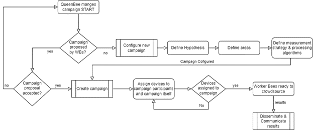
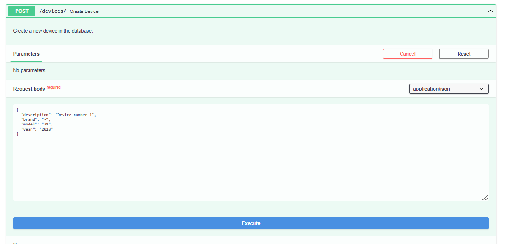
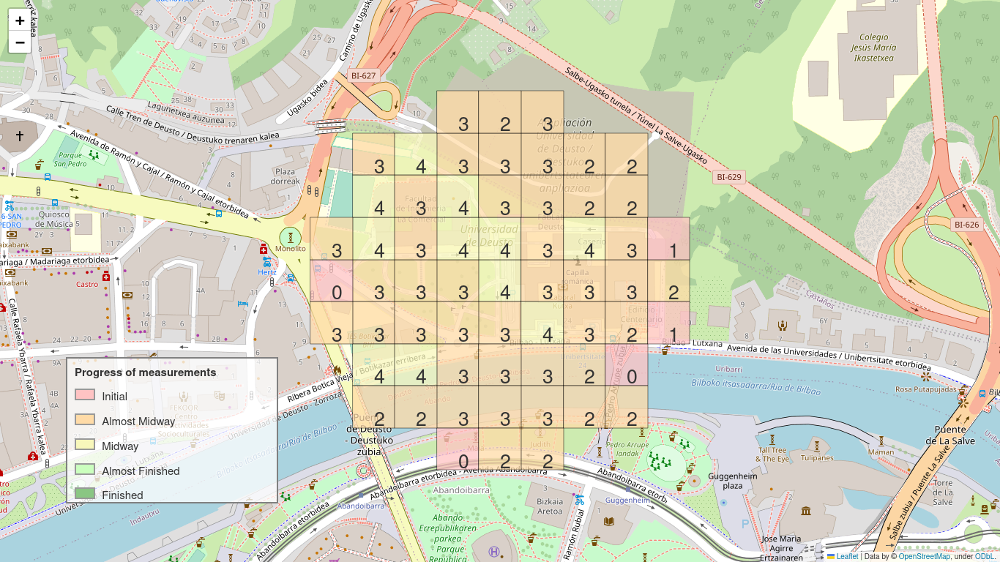
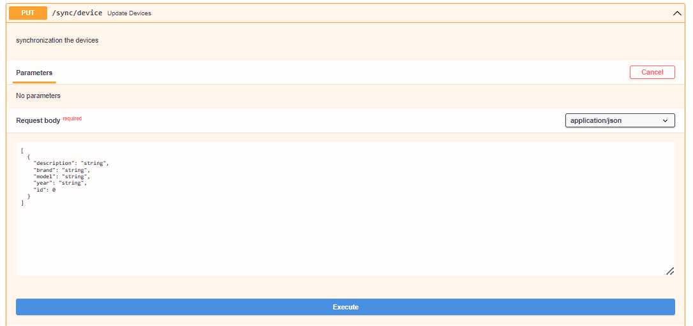
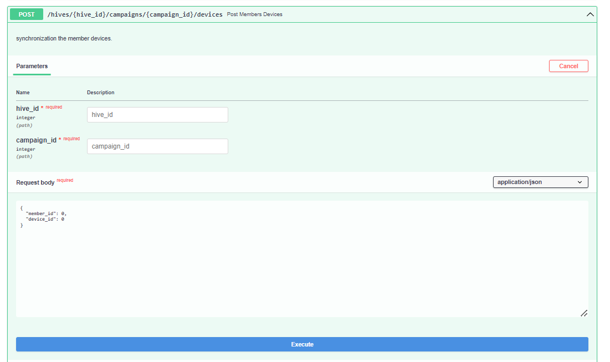

# SOCIO-BEE's Micro-Volunteering Engine (MVE)

## Execution

You may launch with the support of Docker the Micro-Volunteering Engine (MVE). For that follow these steps:
1. `git clone https://github.com/mpuerta004/RecommenderSystem` to get hold of the source code of MVE
2. `cd RecommenderSystem`
3. `docker-compose up`
4. Visit the following URL in your browser: http://localhost:8001/docs

Alternatively, you may follow these manual steps to be able to launch the Micro-Volunteering Engine (MVE): 
1. `git clone https://github.com/mpuerta004/RecommenderSystem` to get hold of the source code of MVE
2. `git fetch --all`
3. `pip install poetry` (or safer, follow the instructions: https://python-poetry.org/docs/#installation)
4. Install dependencies `cd` into the directory where the `pyproject.toml` is located then `poetry install`
5. [UNIX] Run `cd Model` 
6. [UNIX] Run `sudo mysql -uroot -p < BaseDatos.v7.sql`
7. [UNIX] Run `cd ..`
8. [UNIX]: Run the FastAPI server via poetry with the bash script: `poetry run ./run.sh`
9. [WINDOWS]: Run the FastAPI server via poetry with the Python command: `poetry run python src/Servicio/app/main.py`
10. Open http://localhost:8001/docs 

The diagram below shows the process that has to be carried out within SOCIO-BEE to set-up a campaign in a pilot where air quality measurements will be gathered in a certain area and time period in order to deliver visualizations and indicators summarizing the air quality situation and evolution in a spatiotemporal manner. Essentially several steps must be carried out to configure a campaign. Once the campaign is configured the recommendation service from MVE can be requested. 


## Context

The following workflows illustrate how the MVE will be used in the context of the SOCIO-BEE platform. The MVE is a key component responsible to provide the best fitting cells that need to be pollinized given a user's location. MVE is used in SOCIO-BEE, a project where members with different roles (Beekeeper, Queen Bee and Worker Bee) organize, manage and execute Citizen Science campaigns.  

### Beekeeper manages Hive
The following diagram illustrates the main workflow that Bee Keepers will follow when interacting with SOCIO-BEE platform. The main duty of a Bee Keeper, as its name states, is to take care of Hives, i.e. to create new Hives or to select an existing Hive, which could be assigned to run a campaign or set of campaigns which are of interest for the geographical scope of such Bee Keeper. The concrete steps that a Bee Keeper will carry out, aided by the web front-end of SOCIO-BEE, which interacts with the AcadeMe back-end, are as follows:
1. Select or create a new Hive
2. Manage the members of the Hive selected. The Hive may already have a set of members assigned. The Beekeeper can now review such list and edit, add or remove members from the Hive. 
3. Appoint a Queen Bee. For a Hive to be considered as such it should have an appointed Queen Bee. Hence, in this step the Bee Keeper should ensure that a Queen Bee suitable for the envisaged campaigns has been appointed to the Hive. In SOCIO-BEE, we consider that the role of Queen Bee within a Hive should be stable. Still, we allow for a Bee Keeper to appoint a different Queen Bee when a Hive is assigned to different kinds of campaigns in the future or the previous Queen Bee become unavailable. 
4. A Bee Keeper should be interested on the “honey generated”, i.e. results driven from the analysis of the data obtained by the campaigns managed and run by a Hive. Consequently, Beekeepers will also participate in the consumption, use, exploitation, dissemination and communication of the Hive’s campaigns’ results, during the pilots’ iterations.  


### Queen Bee manages Hive's Campaign
The following diagram illustrates the main workflow that a Queen Bee will follow when interacting with SOCIO-BEE platform. The main responsibility of a Queen Bee is to configure and manage Citizen Science campaigns around the Air Quality (AQ) domain for the case of SOCIO-BEE. A Queen Bee provides the domain knowledge and the organizational skills to distribute the sensors and organize campaign participants effectively so that they can execute their measurement duties with the corresponding sensors (wireless air quality measurement devices).   The concrete steps that a Queen Bee will carry out aided by the web front-end of SOCIO-BEE, which interacts with the AcadeMe back-end, are as follows:
1.	A Queen Bee configures a new campaign or accepts a campaign proposed by Worker Bees in the campaign. For a campaign to be configured, different sub-steps must be carried out: a) A research question should be defined; b) A hypothesis formulated; c) An experiment defined, considering the geographical areas to be covered and the types of measurements to be taken, their frequency and duration in time; 
2.	The Queen Bee creates a campaign after reviewing or refining the configuration details of such campaign to make it better suited for the campaign envisaged.
3.	The Queen Bee assigns wearable measurement devices to the campaign participants (Worker Bees). S/he also deploys several static sensors in different geographical areas to support the campaign. Workshops and training activities may be carried out during this step prior to the official launch of the campaign. 
4.	The Queen Bee confirms that the campaign should be started so that Worker Bees can undertake measurements.
5.	The Queen Bee will have a very active role promoting the campaigns, generating intermediary and final results associated communication materials and partaking in events to promote the campaign execution and to publicize the results obtained after the campaign’s execution.  



### Worker Bees participate in Hive's Campaign
The following diagram illustrates the main workflow that a Worker Bee will follow when interacting with SOCIO-BEE platform. The main responsibility of a Worker Bee is to take part in a Citizen Science campaign promoted by SOCIO-BEE, where they have to take air quality (AQ) measurements in different locations in the city, and collaborate with fellow Worker Bees and the leading Queen Bee in reflection sessions where they try to understand and interpret the data gathered at the campaigns.   The concrete steps that a Worker Bee will carry out aided by the mobile front-end of SOCIO-BEE, which interacts with the AcadeMe back-end, are as follows:
1.	A Worker Bee by her/his own initiative or alerted by the mobile app, requests recommendations for nearby accessible locations where it would be interesting to gather measurements to enrich the campaign with further AQ data.
2.	The Worker Bee selects one of the recommendations received and with the support of the mobile app walks to the selected recommendation location. At that location, s/he collects a measurement through the mobile app and with the support of SOCIO-BEE wireless sensor. The Worker Bee may continue gathering additional measurements for a while.
3.	The Worker Bee may regularly check the visualizations accessible through the mobile app which show the status of the measured areas with Air Quality (AQ). Aided by these visualizations, the Worker Bee may also take part in Hive Assemblies where the evolution of the campaign, the intermediary results or the final results are presented, analysed and interpreted. The idea is that the Worker Bee is able to not only gather data but also to educate herself regarding air quality interpretation and possible mitigation actions that could be taken. These Hive campaign retrospective meetings may be interleaved with further measurements been taken by Worker Bees (going back to previous step). 
4.	A Worker Bee will also support the Hive in communication and dissemination activities to spread the word about the lessons learnt whilst executing the campaign. Such lessons may be useful for their society and may eventually lead, upon the reaction of Bear type stakeholders in the design of new policies to enhance air quality in a given city. 


## Use case 1 - Usage workflow of MVE used as an standalone module

1. **Create a Beekeeper:**  Defined at [http://localhost:8001](http://localhost:8001) in secction Beekeeper at the POST endpoint [/beekeepers/](http://localhost:8001/docs#/BeeKeepers/create_beekeeper_beekeepers__post) you can create a new beekeeper by filling out the following request body:
    ```
    {
    "name": "Maite",
    "surname": "Puerta",
    "age": 25,
    "gender": "FEMALE",
    "birthday": "1997-08-07T00:00:00",
    "city": "Bilbao",
    "mail": "--",
    "real_user": true
    }
    ```

    
2. **Create a Hive** Defined at [http://localhost:8001](http://localhost:8001) in secction Hives at the POST endpoint [/hives/](http://localhost:8001/docs#/Hives/create_hive_hives__post), you can create a new hive by filling out the request body of this endpoint: 
    ```
    {
        "city": "Bilbao",
        "beekeeper_id": 1,
        "name": "The best hive"
    }
    ```
    
    
    We can see the newly created hive: 
    

3. **Create Members:** Defined at [http://localhost:8001](http://localhost:8001) in section Member at the POST endpoint [/members/](http://localhost:8001/docs#/Members/create_member_members__post), you can create a new member by filling out the following request body:
     ```
    {
    "name": "Maite",
    "surname": "Beldarrain",
    "age": 25,
    "gender": "FEMALE",
    "city": "Bilabo",
    "mail": "--",
    "birthday": "1997-08-07T00:00:00",
    "real_user": true
    }
     ```
    
    

4. **Associate members with a hive with a role:** Defined at [http://localhost:8001](http://localhost:8001) in section Hive at the POST endpoint [/hives/{hive_id}/members/{member_id}/](http://localhost:8001/docs#/Hives/associate_existing_member_with_a_hive_with_specific_role_hives__hive_id__members__member_id___post) you can asociate a existing user with a hive with a role. In this way, you define the role this user has in the hive by filling out the following request body:
    ```
    {
    "role": "QueenBee"
    }
    ```
    

5. **Define devices:**  Defined at [http://localhost:8001](http://localhost:8001) in secction Devices at the POST endpoint [/devices/](http://localhost:8001/docs#/Device/create_a_device_devices__post), you can define a device. For each device, click on the POST endpoint and then in the "Try it out" button and complete the Request body (picture example) and click execute and filling out the following request body:
    ```
    {
    "description": "Device purple",
    "brand": "-",
    "model": "XRT034",
    "year": "2023"
    }
    ```
    
    And we can see the created device: 
    

6. **Associate a device with a member:** Defined at [http://localhost:8001](http://localhost:8001) in section Member at the POST endpoint [/members{member_id}/devices/{device_id}](http://localhost:8001/docs#/Members/create_member_device_members_member_id__devices__device_id__post), you can associate a device with a member by filling out the following request body:
    ```
    {
    "member_id": 1,
    "device_id": 1
    }
    ```
    

7. **Create a Campaign:** This endpoint requests the MVE to initialize a campaign. Defined at [http://localhost:8001](http://localhost:8001) in section Campaign at the POST endpoint [/hives/{hive_id}/campaigns/](http://localhost:8001/docs#/Campaigns/create_campaign_hives__hive_id__campaigns__post) by filling out the following request body:
    ```
    {
        "campaign_metadata": {
            "title": "Campaign Bilbao Center 1",
            "start_datetime": "2023-02-07T14:00:00",
            "cells_distance": 50,
            "min_samples": 8,
            "sampling_period": 0,
            "end_datetime": "2023-02-07T15:00:00"
            "hypothesis": "Generate air quality mapping"
        },
        "boundary_campaign": {
            "centre": {
            "Longitude": 500,
            "Latitude": 500
            },
            "radius": 300
        }
    }
    ```
   For example, if we want to conduct a brief campaign to collect data on air quality in a particular area, the strategy must include collecting as many measurements as possible during the campaign time (which should not be long). These characteristics should be specified in the POST request body of this endpoint (picture example).
    
    
    Before creating the campaign, you can find out the centres of the cells through the following POST endpoint [/points/](http://localhost:8001/docs#/Sync/create_points_of_campaign_points__post) by filling out the following request body:
    ```
    {
    "centre": {
        "Longitude": 500,
        "Latitude": 500
    },
    "radius": 700,
    "cells_distance": 25
    }
    ```
    This can be done to be able to observe where measurements during the campaign should be obtained.
    
    In addition, after the creation of the campaign, we can visualize the campaign map with the show endpoint at the campaign section [/hives/{hive_id}/campaigns/{campaign_id}/show](http://localhost:8001/docs#/Campaigns/show_a_campaign_hives__hive_id__campaigns__campaign_id__show_get) endpoint. As an example of the result: 
    

8. **Request the MVE to provide recommendations:** This endpoint is enabled to request recommendation of possible cells to which users (Worker Bees) should move in order to pollinize, i.e. grab measurements, in such point. This endpoint returns a configurable number of recommendations, currently the best nearby 3 cell locations for a given user, based on her current location. This endpoint is defined at [http://localhost:8001](http://localhost:8001) in section Recommendations through POST command [/members/{member_id}/recommendations/](http://localhost:8001/docs#/Recommendations/create_recomendation_members__member_id__recommendations__post) by filling out the following request body:
    ```
    {
        "member_current_location": {
            "Longitude": 500,
            "Latitude": 500
        }
    }
    ```
     

9. **Inform MVE about the change of state of a recommendation:** This endpoint is enabled to indicate when a recommendation has been taken by a user (Worker Bee), i.e. the user is being directed to the cell centre. In this case the status of the recommendation would change from NOTIFIED to ACCEPTED. Besides, when a user does take a measurement, then the status of the recommendation is changed to REALIZED automatically. If a notification is never realized, after the slot sampling period is over, the status of the recommendation is changed by MVE to NON_REALIZED actuamatically. This method is defined at [http://localhost:8001](http://localhost:8001) in section Recommendations at the PATCH endpoint [/members/{member_id}/recommendations/{recommendation_id}](http://localhost:8001/docs#/Recommendations/partially_update_recommendation_members__member_id__recommendations__recommendation_id__patch) by filling out the following request body:
    ```
    {
        "state": "ACCEPTED"
    }
    ```
      

10. **Inform MVE about a measurement taken by a member of a hive:** This endpoint is enabled to indicate that a recommendation has been realized delivering a new measurement. The endpoint invocation provides actually the measurement associated to a previous recommendation. This method is defined at [http://localhost:8001](http://localhost:8001) in section Measurements at the POST endpoint [/members/{member_id}/measurements/](http://localhost:8001/docs#/Measurements/create_measurement_members__member_id__measurements__post) by filling out the following request body:
    ```
    {
    "datetime": "2023-02-07T11:09:23.036Z",
    "location": {
        "Longitude": 500,
        "Latitude": 500
    },
    "no2": 1,
    "co2": 10,
    "o3": 4,
    "so02": 3,
    "pm10": 0,
    "pm25": 0,
    "pm1": 0,
    "benzene": 2
    }
    ```
    

11. **DEMO** If we want to visualize how the micro-volunteering engine works, you may execute the demo endpoint [/demos/hives/{hive_id}/campaigns/{campaign_id}](http://localhost:8001/docs#/Demo/asignacion_recursos_demos_hives__hive_id__campaigns__campaign_id__post) in the demo section. The result generated is stored at the src/Servicio/app/Pictures/Measurements,src/Servicio/app/Pictures/Measurements_html and src/Servicio/app/Pictures/Recommender, src/Servicio/app/Pictures/Recommender_html folders. 
    


As an example of a visualization of the recomendation, and the picture that the demo generate into the recommendation folder:


As an ecample of the type of picture that is store in the masurements folder:  


## Use case 2 - Usage workflow of the integration of MVE with external components, e.g. SOCIO-BEE AcadeME
   
Notice that for the MVE to operate it has to be fed with certain context. This is, a Beekeeper must be nominated to a newly created hive, members have to be added to the hive for the MVE to know to whom it should recommend cells to polinize and, then, finally, the MVE would have all the context needed to be able to start issuing recommendations of cells based on hive members current locations. 

1. **Synchronize beekeeper:** This enpoint provides MVE with context about Beekeeper of campaign’s Hive. For that, the endpoint defined at [http://localhost:8001](http://localhost:8001) in section Sync a PUT endpoint [/sync/beekeepers/{beekeeper_id}](http://localhost:8001/docs#/Sync/put_a_beekeeper_sync_beekeepers__beekeeper_id__put) has to be invoked. Click on PUT endpoint and then in the "Try it out" button, complete the Request body (picture example) and click execute. It is a PUT because the Beekeeper may already exist in the MVE but we have to ensure that the Beekeeper managed by the external client, e.g. SOCIO-BEE AcadeME, is also existing in the MVE.  
    Request Body:
    ```
    {
        "name": "Maite",
        "surname": "Puerta",
        "age": 25,
        "gender": "FEMALE",
        "birthday": "1997-08-07T00:00:00",
        "city": "Bilabo",
        "mail": "-",
        "real_user": true
    }
    ```
    

2. **Synchronize Hive:** This endpoint provides MVE with context about Hive that is going to run campaign. For that, we have to synchronize the hive modelled outside the MVE. This endpoint is defined at [http://localhost:8001](http://localhost:8001) in secction Sync with the PUT endpoint  [/sync/hives/{hive_id}](http://localhost:8001/docs#/Sync/update_hive_sync_hives__hive_id__put). 
Click on PUT endpoint and then in the "Try it out" button, complete the Request body (pìcture example) and click execute. 
    
    Request Body:
    ```
    {
        "city": "Bilabo",
        "beekeeper_id": 1,
        "name": "The best Hive"
    }
    ```
    

3. **Synchronize devices:** This endpoint provides the MVE with context about devices that may be used by members of the Hive that are going to take part in campaign. This endpoint is defined at [http://localhost:8001](http://localhost:8001) in secction Sync with method PUT  [/sync/devices](http://localhost:8001/docs#/Sync/update_devices_sync_devices_put). This endpoint is a PUT since if the devices reported did not exist in MVE, they are implicitly created, otherwise they are updated with the supplied details.  Click on PUT endpoint and then in the "Try it out" button, complete the Request body (pìcture example) and click execute.

    Request Body:

    ```
    [
        {
            "description": "Device red",
            "brand": "-",
            "model": "XCR5",
            "year": "2023",
            "id": 1
        },{
            "description": "Device blue",
            "brand": "-",
            "model": "XCR5",
            "year": "2023",
            "id": 2
        }
    ]
    ```
    

4. **Synchronize Member of the hive:** This endpoint provides the MVE with context about members of the Hive that are going to take part in campaign. We have to synchronize hive's members and their roles, with enpoint [http://localhost:8001](http://localhost:8001) in section Sync using PUT method  [/sync/hives/{hive_id}/members/](http://localhost:8001/docs#/Sync/update_members_sync_hives__hive_id__members__put). Click on PUT endpoint and then in the "Try it out" button, complete the Request body (pìcture example) and click execute.
    Request Body:

    ```
    [
        {
            "member": {
                "name": "Maite",
                "surname": "Puerta",
                "age": 25,
                "gender": "FEMALE",
                "birthday": "1997-08-07T00:00:00",
                "city": "Bilabo",
                "mail": "-",
                "real_user": true
                "id": 1
            },
            "role": "WorkerBee"
        },
        {
            "member": {
                "name": "Maite",
                "surname": "Puerta",
                "age": 25,
                "gender": "FEMALE",
                "birthday": "1997-08-07T00:00:00",
                "city": "Bilabo",
                "mail": "-",
                "real_user": true
                "id": 2
            },
            "role": "QueenBee"
        }
    ]
    ```
    

5. **Create a Campaign:** This endpoint requests the MVE to initialize a campaign. This endpoint is enabled to allow Queen Bees to configure a campaign where Citizen Science experiments will be executed. Notice that for the campaign to be able to be initialized, we have to ensure that the context of the campaign has been previously supplied, i.e. through methods to sync beekeeper, hive, hive member and their roles and devices which may be used by a campaign. This endpoint is defined at [http://localhost:8001](http://localhost:8001) in section Campaign through POST method [/hives/{hive_id}/campaigns/](http://localhost:8001/docs#/Campaigns/create_campaign_hives__hive_id__campaigns__post) by filling out the following request body:
    ```
    {
        "campaign_metadata": {
            "title": "Campaign Bilbao Center 1",
            "start_datetime": "2023-02-07T14:00:00",
            "cells_distance": 50,
            "min_samples": 8,
            "sampling_period": 0,
            "end_datetime": "2023-02-07T15:00:00"
            "hypothesis": "Generate air quality mapping"
        },
        "boundary_campaign": {
            "centre": {
            "Longitude": 500,
            "Latitude": 500
            },
            "radius": 300
        }
    }
    ```
   For example, if we want to conduct a brief campaign to collect data on air quality in a particular area, the strategy must include collecting as many measurements as possible during the campaign time (which should not be long). These characteristics should be specified in the POST request body of this endpoint (picture example).
    
    Before creating the campaign, you can find out the centres of the cells through the following POST endpoint [/points/](http://localhost:8001/docs#/Sync/create_points_of_campaign_points__post) by filling out the following request body:
    ```
    {
        "centre": {
            "Longitude": 500,
            "Latitude": 500
        },
        "radius": 40,
        "cells_distance": 100
    }
    ```
    This can be done to be able to observe where measurements during the campaign should be obtained.
    
    In addition, after the creation of the campaign, we can visualize the campaign map with the show endpoint at the campaign section [/hives/{hive_id}/campaigns/{campaign_id}/show](http://localhost:8001/docs#/Campaigns/show_a_campaign_hives__hive_id__campaigns__campaign_id__show_get) endpoint. As an example of the result: 
    

6. **Assign devices to users in newly created campaign:** This endpoint is enabled to allow Queen Bees to assign devices to each of the members of a hive taking part in a campaign. This endpoint is defined at [http://localhost:8001](http://localhost:8001) through POST command [/hives/{hive_id}/campaigns/{campaign_id}/devices](http://localhost:8001/docs#/Sync/post_members_devices_hives__hive_id__campaigns__campaign_id__devices_post). Click on POST endpoint and then in the "Try it out" button, complete the Request body (pìcture example) and click execute.
    Request Body: 
    ```
    {
        "member_id": 1,
        "device_id": 1
    }
    ```
    
    
7. **Request the MVE to provide recommendations:** This endpoint is enabled to request recommendation of possible cells to which users (Worker Bees) should move in order to pollinize, i.e. grab measurements, in such point. This endpoint returns a configurable number of recommendations, currently the best nearby 3 cell locations for a given user, based on her current location. This endpoint is defined at [http://localhost:8001](http://localhost:8001) in section Recommendations through POST command [/members/{member_id}/recommendations/](http://localhost:8001/docs#/Recommendations/create_recomendation_members__member_id__recommendations__post)by filling out the following request body:
    ```
    {
        "member_current_location": {
            "Longitude": 500,
            "Latitude": 500
        },
        "sent_datetime": "2023-02-07T10:52:32.502003"
    }
    ```
    

    


8. **Inform MVE about the change of state of a recommendation:** This endpoint is enabled to indicate when a recommendation has been taken by a user (Worker Bee), i.e. the user is being directed to the cell centre. In this case the status of the recommendation would change from NOTIFIED to ACCEPTED. Besides, when a user does take a measurement, then the status of the recommendation is changed to REALIZED automatically. If a notification is never realized, after the slot sampling period is over, the status of the recommendation is changed by MVE to NON_REALIZED actuamatically. This method is defined at [http://localhost:8001](http://localhost:8001) in section Recommendations at the PATCH endpoint [/members/{member_id}/recommendations/{recommendation_id}](http://localhost:8001/docs#/Recommendations/partially_update_recommendation_members__member_id__recommendations__recommendation_id__patch) by filling out the following request body:
    ```
    {
        "state": "ACCEPTED",
        "update_datetime": "2023-02-07T10:52:32.505306"
    }
    ```
      

9. **Inform MVE about a measurement taken by a member of a hive:** This endpoint is enabled to indicate that a recommendation has been realized delivering a new measurement. The endpoint invocation provides actually the measurement associated to a previous recommendation. This method is defined at [http://localhost:8001](http://localhost:8001) in section Measurements at the POST endpoint [/members/{member_id}/measurements/](http://localhost:8001/docs#/Measurements/create_measurement_members__member_id__measurements__post) by filling out the following request body:
    ```
    {
    "datetime": "2023-02-07T11:09:23.036Z",
    "location": {
        "Longitude": 500,
        "Latitude": 500
    },
    "no2": 0,
    "co2": 0,
    "o3": 0,
    "so02": 0,
    "pm10": 0,
    "pm25": 0,
    "pm1": 0,
    "benzene": 0
    }
    ```
    
